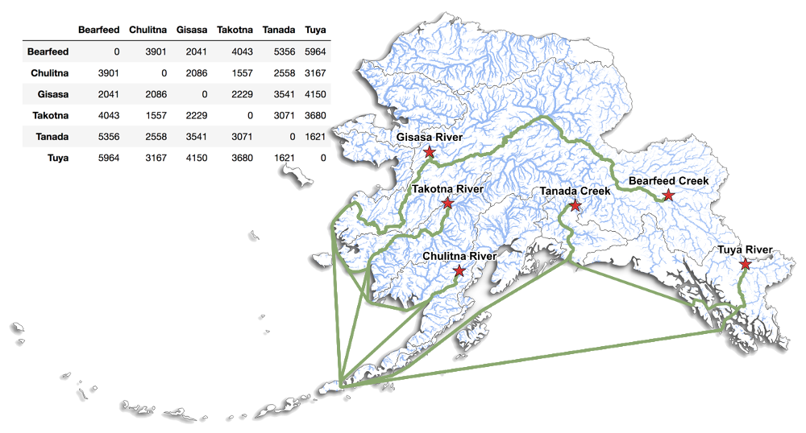

# PyRiv

Minimum aquatic distance (MAD), the shortest path between two points that does not cross land, is a useful metric in the study aquatic organisms. However, MAD can be difficult and time consuming to calculate, particularly for anadromous species where both coastal and riverine distances must be considered. Researchers are often forced to choose between imprecise straight line substitutes and laborious manual path tracing techniques that don’t scale well to large data sets. PyRiv is a free and open source Python library that was created to address this problem. It uses a novel network graph approach to find MAD paths around complex coastlines, and it employs existing hydrography datasets to navigate river networks. By combining these methods, PyRiv can determine MAD between any two points whether they’re on the same river, different rivers, offshore, or any combination. Given a point shapefile as input, PyRiv can return a line shapefile representing MAD paths between all the points as well as a distance matrix in CSV format. Once a network has been prepared for a given area, PyRiv is simple to use and the calculations are fast. 

It's sort of like Google Maps for anadromous fish. Instead of finding paths through a road network, it finds paths through combined river and coastal networks. Basically, you can put in a set of point locations and get back path geometries and a distance matrix, like this:

## Current Status

PyRiv is still under development. The existing code is functional, but messy. Documentation and clean-up is an ongoing process. Please contact the author if you are interested in using it.

## Use Cases

The initial development of PyRiv was motivated by the State of Alaska Salmon and People ([SASAP](https://alaskasalmonandpeople.org/)) project to analyse MAD between the massive number of data collection sites across the state of Alaska and associated Canadian watersheds. PyRiv was also used to calculate MAD for a study of river herring population structure that is currently in press:

> Reid, K., Palkovacs, E.P., Hasselman, D.J., Baetscher, D., Kibele, J., Gahagan, B., Bentzen, P., McBride, M.C., Garza, J.C., (In Press). Comprehensive evaluation of genetic population structure for anadromous river herring with single nucleotide polymorphism data. Fisheries Research 

## Acknowledgements

This work was carried out at [NCEAS](http://nceas.ucsb.edu) as part of the [SASAP](https://alaskasalmonandpeople.org/) project, funded by [The Gordon and Betty Moore Foundation](https://www.moore.org/).